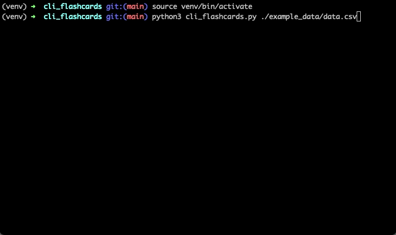

# Command line flashcards

Simple Python script to study with flashcards from the command line.

## Flashcards

From [Wikipedia](https://en.wikipedia.org/wiki/Flashcard): 

> A flashcard or flash card (also known as an index card) is a card bearing information on both sides, which is intended to be used as an aid in memorization. Each flashcard bears a question on one side and an answer on the other. Flashcards are often used to memorize vocabulary, historical dates, formulas or any subject matter that can be learned via a question-and-answer format. Flashcards can be virtual (part of a flashcard software), or physical.

## Script

I have been using the flashcard study technique a lot lately. Many websites or smartphone apps are available to implement this method, but I personally prefer the simplicity of a command-line program.  This project was born to satisfy this need. 

The idea is to have `.csv` files whose rows consist of pairs (question, answer), then randomly extract questions and check the user's knowledge of the answer. If this is negative, the question will remain in the set of questions to be studied and therefore potentially extractable in the future, vice versa the question will be removed and saved as known.

The deck of cards to be studied is provided, as already mentioned, by means of a `.csv` file, the name of which must be specified from the command line via a special parameter. Should the program be terminated before all questions have been correctly guessed, the correct answers given so far will be saved in a file. In this way, it will be possible to restore them the next time the same pack of cards (identified by the given file name) is run.

At each iteration, a question is causally drawn from the pack of cards. The user must enter a single character input in order to continue:

| Char | Meaning                                                                                  |
|------|------------------------------------------------------------------------------------------|
| "y"  | "Yes, I know the answer and remove this card from the deck"                              |
| "n"  | "No, I don't know the answer and keep this card in the deck"                             |
| "s"  | "No, I don't know the answer, keep this card in the deck and show me the correct answer" |
| "q"  | "Save the progress and quit"                                                             |

## Questions file

At the moment, the only format supported for providing questions is `.csv`. This must have the following format: 
- tab (`\t`) as a separator between question and answer;
- new line (`\n`) to separate the different questions.


## Prerequisites


Tested with:
* Docker: 20.10.13
* Python: 3.9.4


## How to build

```bash
docker build -t cli_flashcards .
```

## How to run

### With Docker 

```bash
# Example data
docker run --name cli-flashcards -v $(pwd)/example_data/data.csv:/app/example_data/data.csv -i cli_flashcards ./example_data/data.csv

# To restart
docker start -ai cli-flashcards
```


### Without Docker

#### Setup venv


```bash
python3 -m venv venv/
source venv/bin/activate
pip install --upgrade pip
pip install -r requirements.txt
```

#### Run


```bash
source venv/bin/activate
python cli_flashcards.py ./example_data/data.csv
```

## Demo




## Contributing
Pull requests are welcome. For major changes, please open an issue first to discuss what you would like to change.


## License
[Apache License 2.0](https://choosealicense.com/licenses/apache-2.0/)
